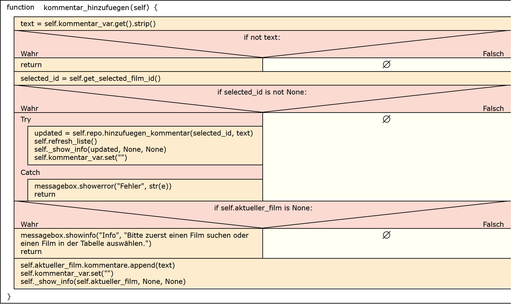

# Film Tracker 

Eine einfache Desktop-Anwendung zur Verwaltung von Filmen.
Der Benutzer kann Filme suchen, speichern, kommentieren und deren Status verwalten.
---
Dieses Projekt wurde zusätzlich auf GitHub veröffentlicht:
https://github.com/ivanovan-dreack/film_tracker
---

## Funktionen
- Filmsuche über OMDb
- Filme zur eigenen Liste hinzufügen
- Status setzen (geplant / gesehen)
- Kommentare zu Filmen
- Anzeigen aller gespeicherten Filme
- Import & Export über JSON und XML

## Struktogramm – Kommentar hinzufügen

